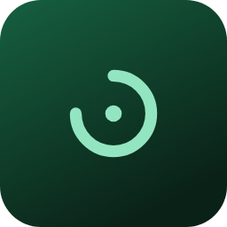

# Sybl

**Everything you have due, in one place.**

 

Sybl is a coursework tracker for students. Connect it to your Brightspace
calendar and it gathers every assignment, quiz and deadline from all of your
courses into one clear list, sorted by what is due next. No more clicking
through each course to work out what is coming up.

## Download

| | |
|---|---|
| **Mac** (M1 or newer) | **[Download Sybl for Mac](https://github.com/MookyEU/Assignment-Tracker-Releases/releases/download/v1.0.9/Sybl_1.0.9_macOS.dmg)** (version 1.0.9) |
| **Windows** (10 or 11) | **[Download Sybl for Windows](https://github.com/MookyEU/Assignment-Tracker-Releases/releases/download/v1.0.8/Sybl_1.0.8_x64-setup.exe)** (version 1.0.8, with 1.0.9 coming soon) |

## How it helps

- **Know what to do next.** *Today* and *This week* show only what is coming up,
  and anything overdue stands out.
- **Every course at a glance.** Each course shows what is overdue, what is due
  this week and what can wait.
- **Deadlines on the right day.** Something due at 11:59pm shows up on the day
  it is actually due.
- **Tick things off** as you finish them, and watch the list get shorter.
- **Make it yours.** Add notes, fix a title or a date, or add something your
  course calendar does not have. Your changes stay put when the calendar updates.
- **Always current.** Sybl checks your calendar every day on its own.
- **On every computer you use.** Sign in, and your ticks and notes follow you from
  your laptop to your desktop.

## Getting started

1. **Install it.** On a Mac, open the download and drag Sybl into Applications.
   On Windows, run the installer. If Windows says the publisher is unknown,
   choose **More info**, then **Run anyway**.
2. **Sign in with your email.** Sybl sends you a code to type in.
3. **Add your calendar.** In Brightspace, open **Calendar**, choose
   **Subscribe**, and paste the link it gives you into Sybl.

That is all. Sybl keeps itself up to date and lets you know in Settings when a
new version is ready.

## Your privacy

Your coursework stays on your computer. When you sign in, Sybl saves what you
have done in it (your ticks, notes and changes) and your calendar link to your
account, so your other computers can have them too. It never sees your grades.
Your account is stored in Canada, and you can download everything in it, or
delete it, from Settings at any time.

---

The `updates` folder is how Sybl updates itself, and there is nothing in it to download. Older versions are on the [releases page](../../releases).
